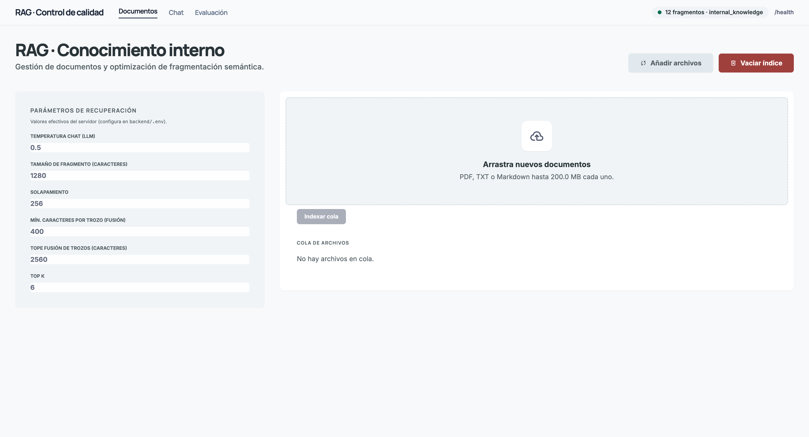
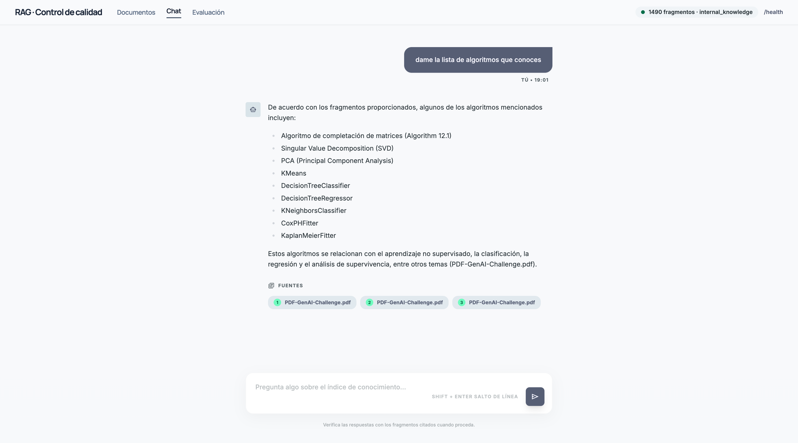
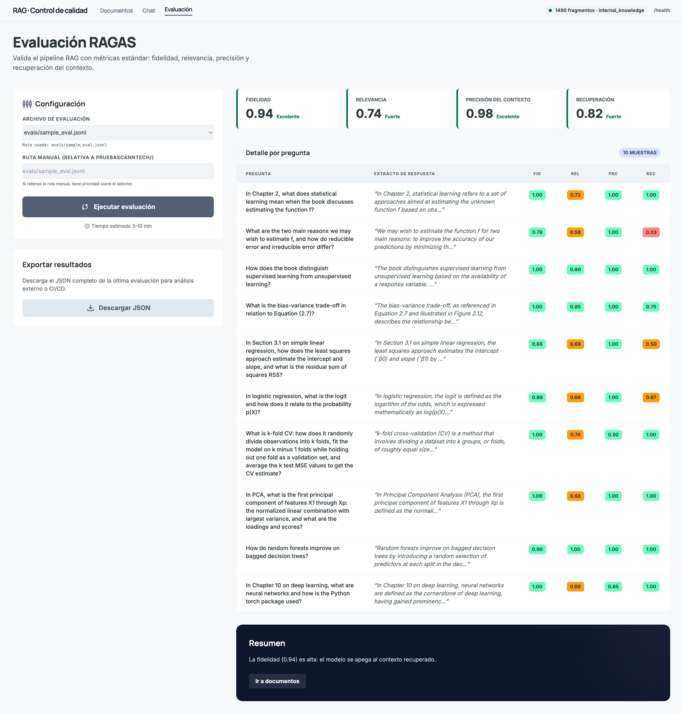
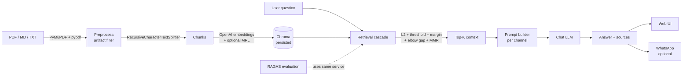

<div align="center">

# RAG Quality Platform

### Production-grade Retrieval-Augmented Generation — with built-in evaluation, multi-channel delivery, and edge deployment

[](https://www.python.org/)
[](https://fastapi.tiangolo.com/)
[](https://react.dev/)
[](https://www.typescriptlang.org/)
[](https://www.trychroma.com/)
[](https://www.langchain.com/)
[](https://platform.openai.com/)
[](LICENSE)

*A complete RAG stack — ingestion, retrieval, generation, evaluation, and multi-channel delivery — designed to **ship to production**, not just to demo.*

</div>

---

## ✨ What makes this different

Most RAG repositories stop at *"the bot answers questions."* This one goes further:

| | |
|---|---|
| 🔬 **Evaluation built into the product** | [RAGAS](https://docs.ragas.io/) metrics (faithfulness, answer relevancy, context precision, context recall) running in the **same service** that serves chat. Click a button — get numbers. |
| 🎯 **Production retrieval pipeline** | L2 distance + absolute threshold + relevance margin + elbow-gap cutoff + optional MMR — not a naive `top_k`. Final ordering by relevance after MMR. |
| 📡 **Multi-channel delivery** | Web UI + optional WhatsApp integration (via [GOWA](https://github.com/aldinokemal/go-whatsapp-web-multidevice)), with per-channel system prompts editable at runtime — no restart required. |
| ⚡ **Edge-deployable** | Self-hosted GitHub Actions runner on NVIDIA Jetson Nano (ARM64). Push to `main` → live on the device. |
| 📄 **Real-document hardening** | PyMuPDF + pypdf fallback, vector-figure artifact filtering, MRL-aware embeddings (`text-embedding-3-*`), schema-aware index reset. |

> **Stack:** FastAPI · React + Vite + TypeScript · Chroma · LangChain · OpenAI · RAGAS · Nginx · PM2 · GitHub Actions

---

## 📸 Screenshots

| Documents — ingest & govern the index | Chat — answers grounded in your corpus | Evaluation — RAGAS in the UI |
|:---:|:---:|:---:|
|  |  |  |
| Upload PDF/MD/TXT, queue ingestion, monitor progress, inspect retrieval parameters live. | Answers in the language of the question, with expandable source extracts per turn. | Run RAGAS on a `.jsonl` dataset; see aggregated metrics and per-question breakdown. |

---

## 🏗️ Architecture



For full diagrams and API reference: [`docs/ARQUITECTURA.md`](docs/ARQUITECTURA.md)
For the chatbot reasoning model (clarification, threading, prompts): [`docs/ARQUITECTURA_CHATBOT.md`](docs/ARQUITECTURA_CHATBOT.md)

---

## 🚀 Quick Start

### Prerequisites

- Python 3.11+ (3.14 may show LangChain warnings)
- Node.js 20+
- An OpenAI API key (or any compatible endpoint via `OPENAI_API_BASE`)

### Backend

```bash
cd backend
cp .env.example .env
# Edit .env and set OPENAI_API_KEY

python -m venv .venv
source .venv/bin/activate          # Windows: .venv\Scripts\activate
pip install -r requirements.txt

uvicorn app.main:app --reload --host 0.0.0.0 --port 3333
# or: chmod +x run_dev.sh && ./run_dev.sh
```

### Frontend

```bash
cd frontend
cp .env.example .env
# Optional: set VITE_API_BASE_URL (e.g., http://127.0.0.1:3333)

npm install
npm run dev
# UI on http://localhost:4444
```

Drop your PDF / MD / TXT into `data/`, upload from the UI, and start asking.

---

## 🔍 Features in detail

### 1. Retrieval pipeline — five filters, not one

A naive `top_k` returns the *k* most similar chunks regardless of how similar they actually are. This pipeline is layered:

1. **Similarity (L2)** — candidate set from Chroma.
2. **Absolute threshold** — drop anything beyond `RETRIEVE_MAX_L2_DISTANCE`.
3. **Relevance margin** — keep only chunks within `best + RETRIEVE_RELEVANCE_MARGIN`.
4. **Elbow gap** *(optional)* — cut where `RETRIEVE_ELBOW_L2_GAP` indicates a discontinuity.
5. **MMR** *(optional)* — pick up to `TOP_K` with diversity.
6. **Re-rank** — final ordering by relevance (smallest distance first) for the prompt.

### 2. Embeddings with MRL support

OpenAI's `text-embedding-3-*` models support [Matryoshka Representation Learning](https://openai.com/index/new-embedding-models-and-api-updates/) — embeddings whose **dimensions can be truncated** without retraining. Configure via `OPENAI_EMBEDDING_MODEL` and `OPENAI_EMBEDDING_DIMENSIONS`. Each Chroma collection locks its vector size on creation; **changing the model or dimensions requires `POST /ingest/reset`** before re-indexing.

### 3. Evaluation with RAGAS — on the production service

The Evaluation tab calls `POST /evaluate` against `evals/sample_eval.jsonl` (10 Q–A pairs grounded in *An Introduction to Statistical Learning with Python* — a real, ~600-page textbook). What you measure is exactly what users get.

| Metric | What it measures |
|---|---|
| `faithfulness` | Is the answer grounded in retrieved context? |
| `answer_relevancy` | Does it actually address the question? |
| `context_precision` | Are the retrieved chunks the right ones? |
| `context_recall` | Are we missing relevant evidence? |

```bash
# CLI equivalent
curl -X POST "http://127.0.0.1:3333/evaluate?eval_relative_path=evals/sample_eval.jsonl"
```

### 4. Multi-channel delivery (Web + WhatsApp)

The same `RAGService` powers both channels with **per-channel system prompts** editable at runtime:

```
GET    /config/prompts           # current prompts
PUT    /config/prompts           # update without restart
DELETE /config/prompts           # reset to defaults
```

The WhatsApp integration is optional and works against any [GOWA](https://github.com/aldinokemal/go-whatsapp-web-multidevice)-compatible bridge. Two modes:

- **Polling** — `GET /messages/recent` or `GET /chats` + `GET /messages?chat_jid=…`
- **Webhook** — `POST /webhooks/whatsapp` from the bridge to this server

See [`docs/VARIABLES_ENTORNO.md`](docs/VARIABLES_ENTORNO.md) for `WHATSAPP_*` variables.

### 5. Document handling tuned for academic PDFs

Long, figure-heavy PDFs (e.g. 600+ page textbooks) tend to break naive ingestion. This pipeline:

- Uses **PyMuPDF** for better reading order, with **pypdf** as fallback.
- Filters lines dominated by `|` (typical artifact of vector-figure extraction).
- Defaults tuned for long form: `CHUNK_SIZE=1280`, `CHUNK_OVERLAP=256` (~20%), `TOP_K=6`, `MMR_FETCH_K=80`, `MMR_LAMBDA=0.91`.
- Async ingestion (`asyncio.to_thread`) so large uploads don't block the event loop.

> ⚠️ **If you change** `CHUNK_SIZE`, `CHUNK_OVERLAP`, the embedding model, or `OPENAI_EMBEDDING_DIMENSIONS` — run **Reset index** in the UI (or `POST /ingest/reset`) and re-ingest.

---

## 📡 API reference

| Method | Path | Purpose |
|---|---|---|
| `GET` | `/health` | Liveness probe |
| `GET` | `/stats` | Total chunks indexed |
| `GET` | `/stats/sources` | Sources currently in the index |
| `GET` | `/config` | Effective server configuration |
| `GET` `PUT` `DELETE` | `/config/prompts` | System prompts per channel (no restart) |
| `POST` | `/ingest` | Multipart upload (`files`); returns `files_processed`, `chunks_added`, `chunk_count`, `ready` |
| `POST` | `/ingest/delete-source` | Remove a single source by name |
| `POST` | `/ingest/reset` | Drop the Chroma collection |
| `POST` | `/chat` | `{ "question": "..." }` |
| `GET` | `/retrieve?q=…` | Retrieval-only (useful for evaluation) |
| `POST` | `/evaluate?eval_relative_path=…` | Run RAGAS on a JSONL dataset |
| `GET` `POST` | `/webhooks/whatsapp` | WhatsApp bridge entrypoint |
| `GET` `POST` `PUT` | `/whatsapp/allowlist` | Phone-number allowlist |

`POST /ingest` runs preprocessing and chunking in a thread to keep the event loop free; production deployments use Nginx with an elevated `proxy_read_timeout` (see `scripts/nginx-rag.conf`).

`MAX_UPLOAD_BYTES` (default 200 MiB) caps individual uploads.

---

## 🚢 Deployment — Jetson Nano + GitHub Actions

```
┌─────────────────┐     ┌─────────────────────┐
│   GitHub Repo   │────▶│   GitHub Actions    │
│                 │     │  Workflow: deploy   │
└─────────────────┘     └──────────┬──────────┘
                                   │
                          ┌────────▼──────────┐
                          │ Self-Hosted Runner│
                          │  NVIDIA Jetson    │
                          │   Nano (ARM64)    │
                          └────────┬──────────┘
                                   │
       ┌───────────────────────────┼───────────────────────────┐
       ▼                           ▼                           ▼
┌──────────────┐          ┌────────────────┐          ┌──────────────┐
│ FastAPI :3333│          │ React (Nginx)  │          │ WhatsApp     │
│ + Chroma     │          │ /var/www/rag   │          │ GOWA :8090   │
└──────────────┘          └────────────────┘          └──────────────┘
```

The workflow lives in [`.github/workflows/deploy.yml`](.github/workflows/deploy.yml). On every push to `main`:

1. **Build** the frontend (`npm ci && npm run build`).
2. **Copy** `frontend/dist` into the Nginx document root (e.g. `/var/www/rag`).
3. **Copy** the backend into a fixed path on the device (e.g. `~/workspace/codla/backend`).
4. **Apply** Nginx config from `scripts/nginx-rag.conf` (long `proxy_read_timeout` for `/ingest`, generous `client_max_body_size`).

### Setting up the runner

```bash
# On the Jetson, once
mkdir -p ~/actions-runner && cd ~/actions-runner
curl -o actions-runner-linux-arm64.tar.gz -L \
  https://github.com/actions/runner/releases/download/v2.333.1/actions-runner-linux-arm64-2.333.1.tar.gz
tar xzf actions-runner-linux-arm64.tar.gz

./config.sh --url https://github.com/<you>/<repo> --token <TOKEN>
sudo ./svc.sh install && sudo ./svc.sh start
```

---

## ⚙️ Configuration

Every knob lives in `backend/.env` (see `backend/.env.example`). Highlights:

| Variable | Default | Notes |
|---|---|---|
| `OPENAI_API_KEY` | — | Required |
| `OPENAI_EMBEDDING_MODEL` | `text-embedding-3-small` | `-large` available |
| `OPENAI_EMBEDDING_DIMENSIONS` | *(native)* | MRL truncation |
| `CHUNK_SIZE` / `CHUNK_OVERLAP` | `1280` / `256` | Tuned for long PDFs |
| `TOP_K` | `6` | Final context size |
| `MMR_FETCH_K` / `MMR_LAMBDA` | `80` / `0.91` | Diversity tuning |
| `RETRIEVE_MAX_L2_DISTANCE` | — | Absolute filter |
| `RETRIEVE_RELEVANCE_MARGIN` | — | Relative filter |
| `RETRIEVE_ELBOW_L2_GAP` | — | Discontinuity cut |
| `MAX_UPLOAD_BYTES` | `200 MiB` | Per-file cap |
| `WHATSAPP_*` | — | Optional WhatsApp bridge |

Full reference and rules of thumb: [`docs/VARIABLES_ENTORNO.md`](docs/VARIABLES_ENTORNO.md).

---

## 🗂️ Project structure

```
rag-chroma/
├── .github/workflows/
│   └── deploy.yml              # Self-hosted runner deployment
├── backend/
│   ├── app/
│   │   ├── main.py             # FastAPI entry
│   │   ├── config.py           # Settings
│   │   ├── rag_service.py      # Orchestration
│   │   ├── preprocess.py       # PDF/MD/TXT ingestion
│   │   ├── evaluation.py       # RAGAS runner
│   │   ├── prompts.py          # Channel-aware prompts
│   │   ├── prompt_store.py     # Runtime-editable prompts
│   │   ├── whatsapp_poll.py    # WhatsApp integration
│   │   └── persistence/        # Chroma store
│   ├── rag-backend.service     # systemd unit
│   ├── requirements.txt
│   └── .env.example
├── frontend/
│   ├── src/                    # React + Vite + TS
│   ├── rag-frontend.service
│   └── package.json
├── docs/
│   ├── ARQUITECTURA.md
│   ├── ARQUITECTURA_CHATBOT.md
│   ├── VARIABLES_ENTORNO.md
│   └── images/
├── evals/
│   └── sample_eval.jsonl       # ISLP-grounded eval set
├── scripts/
│   ├── nginx-rag.conf
│   └── install-runner.sh
└── README.md
```

---

## 🗺️ Roadmap

- [ ] Hybrid retrieval (BM25 + dense) with reciprocal rank fusion
- [ ] Cross-encoder reranker as a final stage
- [ ] Per-source access control on retrieval
- [ ] Streaming SSE responses to the frontend
- [ ] Docker Compose for one-command local setup
- [ ] OpenTelemetry traces across retrieval → generation

Issues and PRs welcome.

---

## 📄 License

[MIT](LICENSE) — use it, fork it, ship it.

---

## 👤 Author

**Diego Fernando Echeverry Londoño** — Senior AI Engineer

[](https://codytion.com/)
[](https://linkedin.com/in/godie007)
[](https://github.com/godie007)
[](mailto:diegof.e3@gmail.com)

> *I don't just build AI — I ship it to production at global scale.*

---

<div align="center">

If this project helped you, consider giving it a ⭐ — it helps others find it.

</div>
