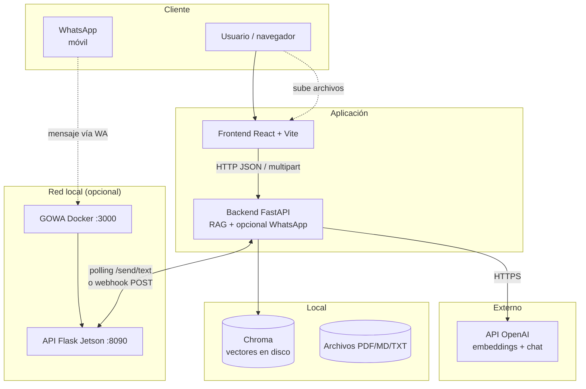
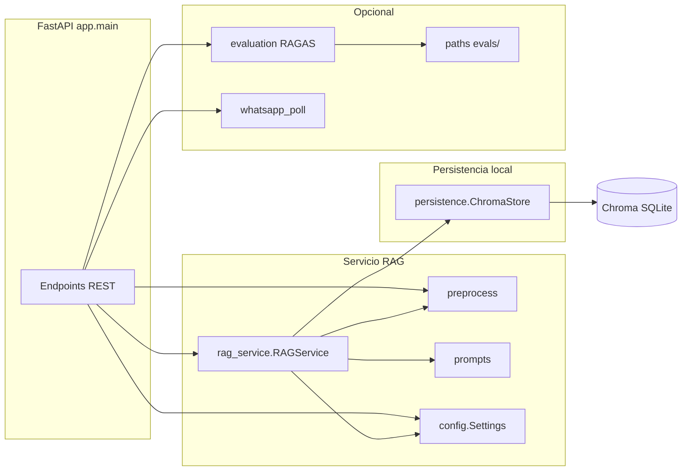
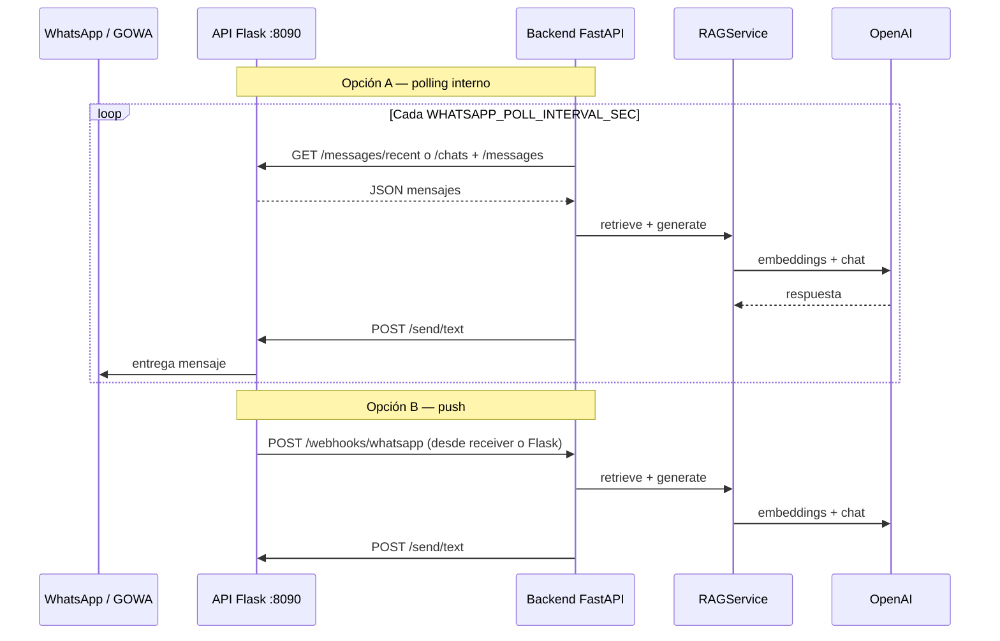
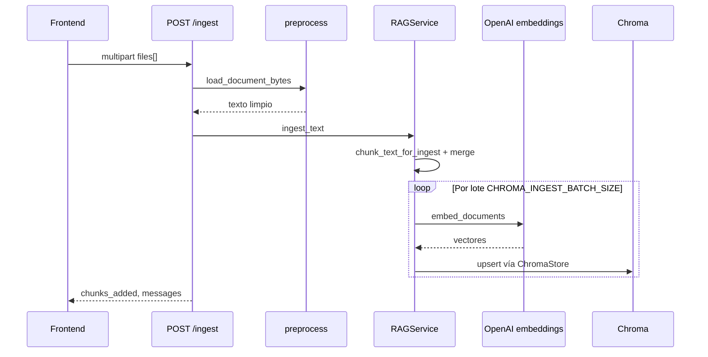
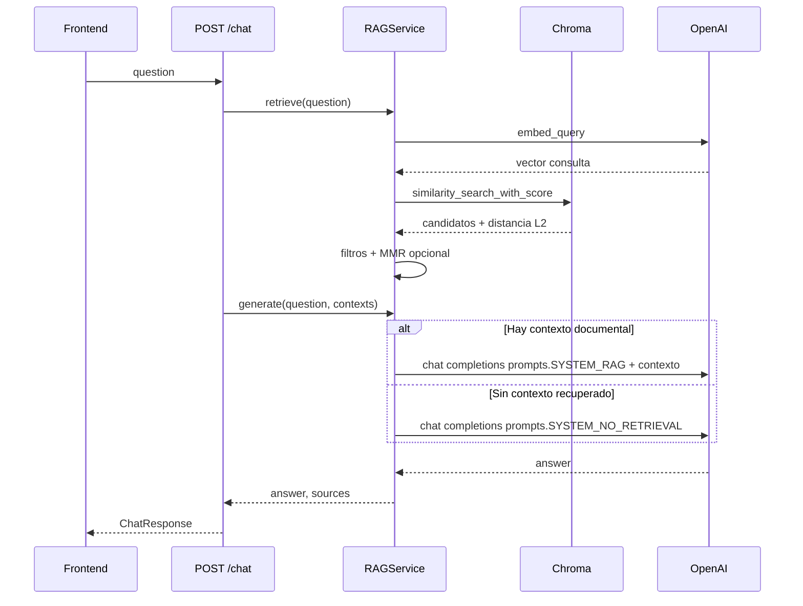
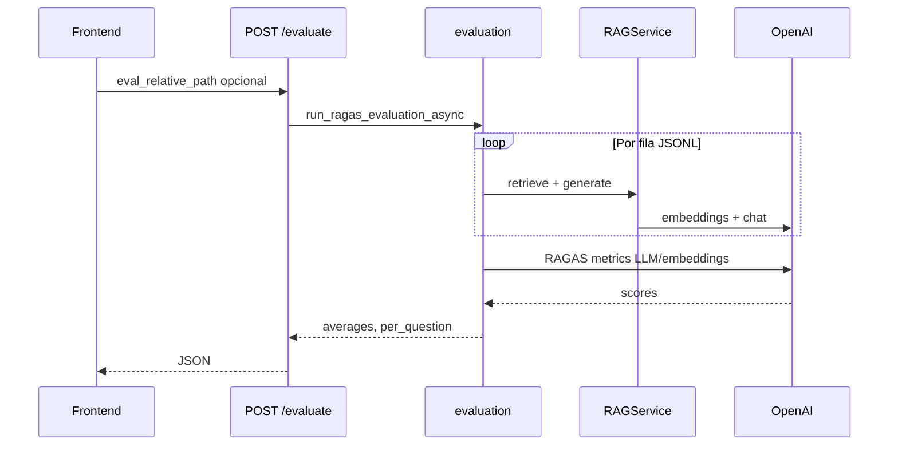
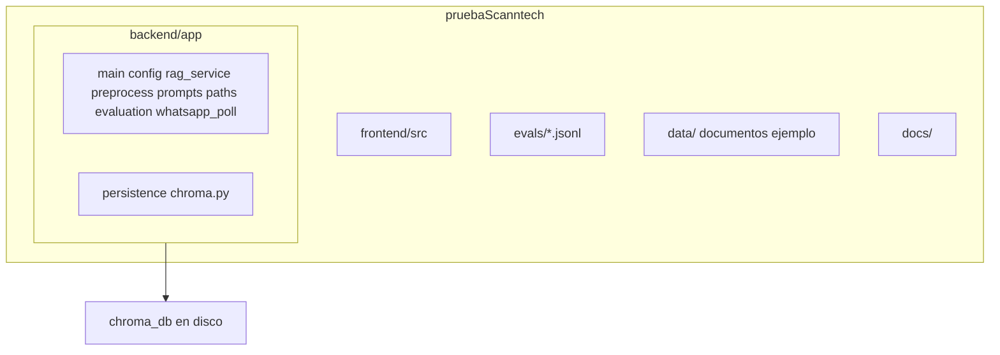

# Arquitectura del sistema RAG

Documento de referencia para la prueba técnica: componentes, flujos, persistencia, **prompts del LLM** y **variables de entorno** alineadas con `backend/app/config.py` y los `.env.example`.

---

## 1. Objetivo

Sistema **RAG** (Retrieval-Augmented Generation) para **control de calidad del conocimiento interno**: los usuarios indexan documentos (PDF, Markdown, texto), el backend recupera contenido relevante con embeddings y un LLM genera respuestas ancladas a la documentación, con **lenguaje claro** hacia el usuario final (sin jerga interna tipo “fragmentos” en las respuestas). La evaluación **RAGAS** mide fidelidad, relevancia, precisión y recuperación del contexto. Opcionalmente, el mismo flujo alimenta **respuestas por WhatsApp** vía una API HTTP en red (p. ej. Jetson + GOWA).

---

## 2. Vista de contexto

Actores externos, aplicación y almacenes lógicos.



- **Frontend**: no contiene secretos; solo llama al backend.
- **Backend**: único componente con `OPENAI_API_KEY` y acceso a Chroma; opcionalmente consulta la **API WhatsApp** en otro host (p. ej. Jetson) y expone `POST /webhooks/whatsapp`.
- **Chroma**: SQLite + archivos de persistencia bajo `CHROMA_PERSIST_DIRECTORY`.
- **Jetson (opcional)**: GOWA en **:3000** y servicio Flask en **:8090**; el RAG solo usa HTTP al **:8090**. Endpoints de lectura relevantes: **`GET /messages/recent`** (últimos mensajes globales; cada ítem incluye **`is_from_me: true|false`**) y **`GET /messages?chat_jid=…`** (historial de un chat; mismo campo). Envío: **`POST /send/text`**. Lista de chats: **`GET /chats`**.

---

## 3. Contenedores y módulos del backend



| Módulo | Rol |
|--------|-----|
| `main.py` | Rutas HTTP, modelos Pydantic, CORS, ciclo de vida (`lifespan`). |
| `config.py` | `Settings`: lectura de `.env` y validación (p. ej. ruta absoluta de Chroma). |
| `rag_service.py` | Orquesta embeddings, chunking, recuperación (L2, margen, codo, MMR) y llamadas al LLM; usa `ChromaStore` y `prompts`. |
| `persistence/chroma.py` | `ChromaStore`: cliente LangChain Chroma, permisos y prueba de escritura en disco, ingesta por lotes con reintento ante sqlite readonly, conteo y borrado de la carpeta de persistencia. |
| `prompts.py` | Instrucciones de sistema (`SYSTEM_RAG`, `SYSTEM_NO_RETRIEVAL`) y plantillas de mensaje de usuario (`build_rag_user_message`, etc.). |
| `preprocess.py` | Carga de documentos, limpieza PDF, segmentación por fences Markdown, fusión de trozos cortos. |
| `evaluation.py` | Pipeline RAGAS asíncrono sobre el mismo `RAGService`. |
| `paths.py` | Resolución segura de rutas bajo `evals/`. |
| `whatsapp_poll.py` | Integración WhatsApp: polling a la API remota, webhook entrante, deduplicación, eco de respuestas del bot, envío `POST /send/text`. |

---

## 3B. Secuencia: WhatsApp (polling o webhook)

Mismo núcleo RAG que `POST /chat`; la salida se envía al número vía API Jetson.



---

## 4. Secuencia: ingesta de documentos



Tras cambiar `CHUNK_SIZE` / `CHUNK_OVERLAP` conviene `POST /ingest/reset` y volver a subir archivos.

---

## 5. Secuencia: chat (pregunta → respuesta)



---

## 6. Secuencia: evaluación RAGAS

RAGAS y dependencias (`datasets`, etc.) van en el mismo `requirements.txt` del backend.



---

## 7. Estructura de carpetas (alto nivel)



- **`backend/app/persistence/`**: capa de infraestructura para Chroma (`ChromaStore` en `chroma.py`); separa I/O y permisos de la lógica RAG en `rag_service.py`.
- **`backend/app/prompts.py`**: único lugar habitual para editar textos de sistema y plantillas de usuario del chat; incluye reglas de **tono** hacia el usuario final (evitar jerga tipo “fragmentos” o “RAG” en respuestas).

---

## 8. Variables de entorno — backend

Definidas en `backend/app/config.py` (Pydantic Settings). Los nombres en **MAYÚSCULAS** son los de entorno; el código usa `snake_case`. La **justificación** de cada valor por defecto y cuándo cambiarlo está en [VARIABLES_ENTORNO.md](./VARIABLES_ENTORNO.md).

| Variable (env) | Campo en código | Tipo / default | Descripción |
|----------------|-----------------|----------------|-------------|
| `OPENAI_API_KEY` | `openai_api_key` | `str`, `""` | Obligatoria para RAG: embeddings y chat. Si falta, `_rag` queda en `None`. |
| `OPENAI_CHAT_MODEL` | `openai_chat_model` | `gpt-4o-mini` | Modelo de chat para respuestas y ramas sin contexto. |
| `OPENAI_CHAT_TEMPERATURE` | `openai_chat_temperature` | `0.1` | Temperatura del chat RAG (`/chat`); validado entre 0 y 2. |
| `OPENAI_EMBEDDING_MODEL` | `openai_embedding_model` | `text-embedding-3-small` | Modelo de embeddings para índice y consultas. |
| `OPENAI_API_BASE` | `openai_api_base` | `None` | Base URL opcional (Azure OpenAI u otro compatible). |
| `CHROMA_PERSIST_DIRECTORY` | `chroma_persist_directory` | `./chroma_db` | Carpeta de persistencia Chroma. Las rutas **relativas** se resuelven respecto a **`backend/`**, no al CWD de uvicorn. |
| `CHROMA_COLLECTION_NAME` | `chroma_collection_name` | `internal_knowledge` | Nombre de la colección vectorial. |
| `CHROMA_INGEST_BATCH_SIZE` | `chroma_ingest_batch_size` | `128` | Tamaño de lote al hacer `add_documents` (PDFs grandes). |
| `CHUNK_SIZE` | `chunk_size` | `1280` | Tamaño máximo aproximado del fragmento (caracteres). |
| `CHUNK_OVERLAP` | `chunk_overlap` | `256` | Solapamiento entre fragmentos del splitter recursivo. |
| `CHUNK_MIN_CHARS` | `chunk_min_chars` | `400` | Mínimo objetivo por trozo tras fusionar títulos sueltos con el vecino. |
| `CHUNK_MERGE_HARD_MAX` | `chunk_merge_hard_max` | `0` | Tope al fusionar trozos; **`0` = 2 × CHUNK_SIZE**. |
| `TOP_K` | `top_k` | `6` | Máximo de fragmentos pasados al LLM tras recuperación/MMR. |
| `USE_MMR` | `use_mmr` | `true` | Activa Maximum Marginal Relevance para diversidad. |
| `MMR_FETCH_K` | `mmr_fetch_k` | `80` | Candidatos a considerar antes de MMR. |
| `MMR_LAMBDA` | `mmr_lambda` | `0.91` | Balance relevancia vs diversidad en MMR (más alto = más relevancia). |
| `RETRIEVE_MAX_L2_DISTANCE` | `retrieve_max_l2_distance` | `1.3` | Umbral L2 de Chroma: por encima se descarta el candidato. |
| `RETRIEVE_RELEVANCE_MARGIN` | `retrieve_relevance_margin` | `0.10` | Solo se mantienen fragmentos con distancia ≤ mejor + margen (con ajuste si `best_d ≥ 0.75`). |
| `RETRIEVE_ELBOW_L2_GAP` | `retrieve_elbow_l2_gap` | `0.0` | Si > 0, corta la lista cuando el salto L2 entre vecinos ordenados supera este valor. |
| `CORS_ORIGINS` | `cors_origins` | `http://localhost:4444,...` | Orígenes permitidos, separados por coma. |
| `MAX_UPLOAD_BYTES` | `max_upload_bytes` | `209715200` (~200 MiB) | Tamaño máximo por archivo en `POST /ingest`. |
| `LLM_RETRIEVAL_PROFILE` | `llm_retrieval_profile` | `true` | Mini-llamada LLM para decidir recuperación amplia vs normal. |

**WhatsApp** (`WHATSAPP_*`): ver [VARIABLES_ENTORNO — WhatsApp](./VARIABLES_ENTORNO.md#whatsapp-jetson) y `backend/.env.example`.

---

## 9. Variables de entorno — frontend

| Variable | Descripción |
|----------|-------------|
| `VITE_API_BASE_URL` | URL base del API FastAPI (sin barra final). Por defecto en código: `http://127.0.0.1:3333`. |

Vite solo expone al bundle variables que empiezan por `VITE_`.

---

## 10. API REST (resumen)

| Método | Ruta | Uso |
|--------|------|-----|
| `GET` | `/health` | Estado del servicio y si el RAG está inicializado. |
| `GET` | `/stats` | `chunk_count`, `collection`, `ready`. |
| `GET` | `/config` | Parámetros públicos de chunking y recuperación (sin secretos). |
| `POST` | `/ingest` | Multipart, campo `files`: indexa PDF/MD/TXT. |
| `POST` | `/ingest/reset` | Borra persistencia Chroma en disco y recrea índice vacío. |
| `POST` | `/chat` | Body JSON `{"question": "..."}` → `answer` + `sources`. |
| `GET` | `/retrieve` | Depuración: contextos recuperados para `q`. |
| `POST` | `/evaluate` | RAGAS; query opcional `eval_relative_path`. |
| `GET` | `/webhooks/whatsapp` | Comprobación e indicaciones de integración (WhatsApp). |
| `POST` | `/webhooks/whatsapp` | Cuerpo JSON con mensaje(s) entrante(s); opcional secreto vía cabecera (ver `WHATSAPP_WEBHOOK_SECRET`). |

`GET /config` expone, entre otros, `whatsapp_polling_active`, `whatsapp_webhook_active`, `whatsapp_poll_mode`, `whatsapp_api_base_url`, `whatsapp_poll_interval_sec` (sin secretos).

---

## 11. Decisiones de diseño breves

- **Precisión documental**: con contexto recuperado del índice, el system prompt en `app.prompts` (`SYSTEM_RAG`) exige ceñirse al material documental; sin coincidencias útiles se usa `SYSTEM_NO_RETRIEVAL` para distinguir preguntas meta de falta de cobertura.
- **Lenguaje al usuario**: las instrucciones del LLM piden tono profesional y evitan términos técnicos internos (“fragmentos”, “embeddings”) en las respuestas finales, salvo que el usuario pregunte cómo funciona la herramienta.
- **PDF**: PyMuPDF primero; limpieza de artefactos (`|`, glifos, ejes) en `preprocess.py`.
- **Código en Markdown**: separadores y segmentación por bloques `` ``` `` para no partir fences completos cuando caben en el tope de fusión.
- **Chroma**: persistencia local gestionada por `ChromaStore`; el reset elimina la carpeta configurada (con salvaguardas de ruta en `RAGService`) para evitar índices huérfanos.

---

*Última revisión: integración WhatsApp (`whatsapp_poll.py`), webhooks, diagrama de red Jetson y tono de respuestas en `prompts.py`; alineado con `backend/app` y `frontend/src`.*
