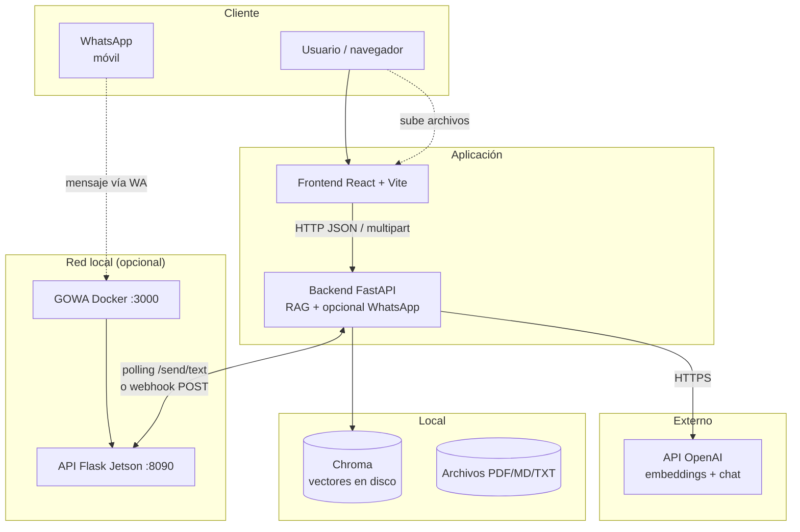
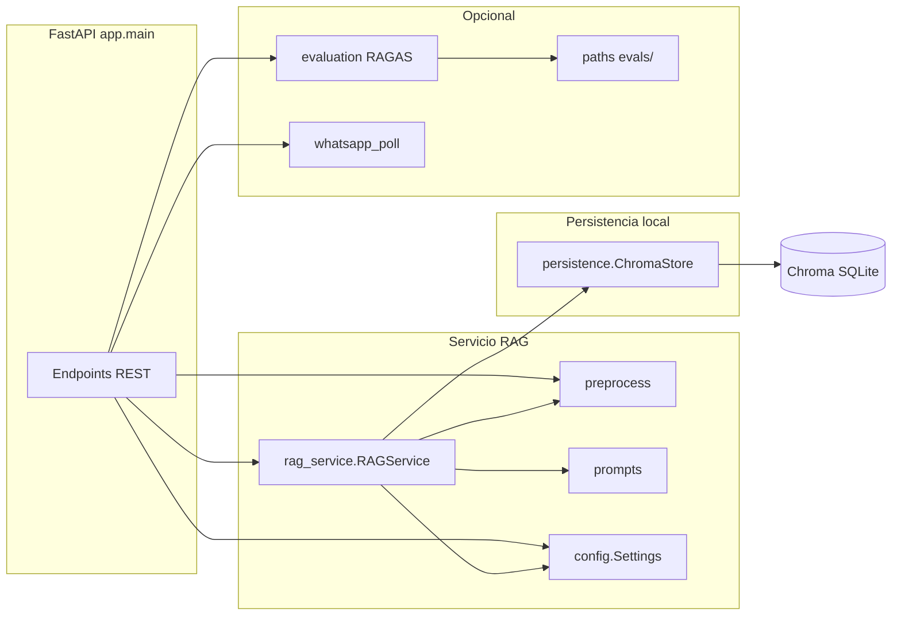
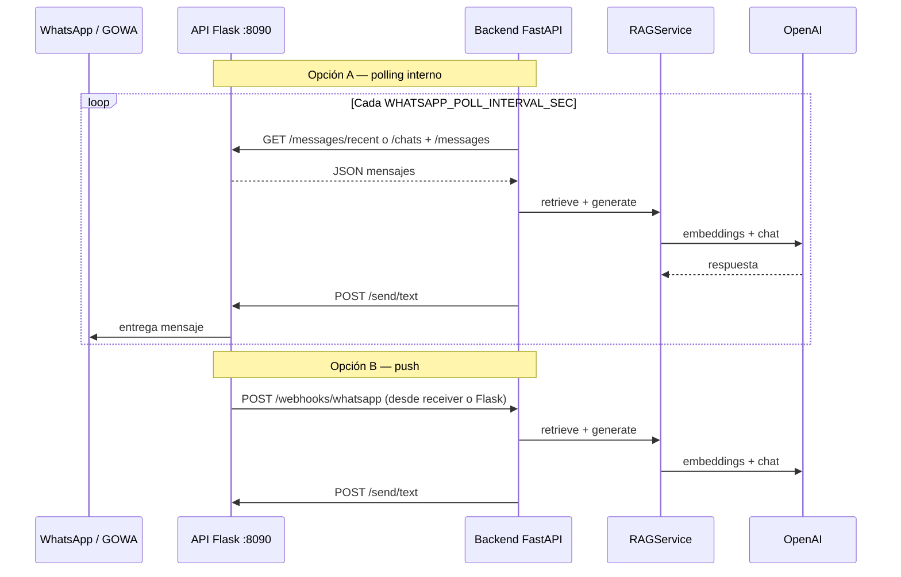
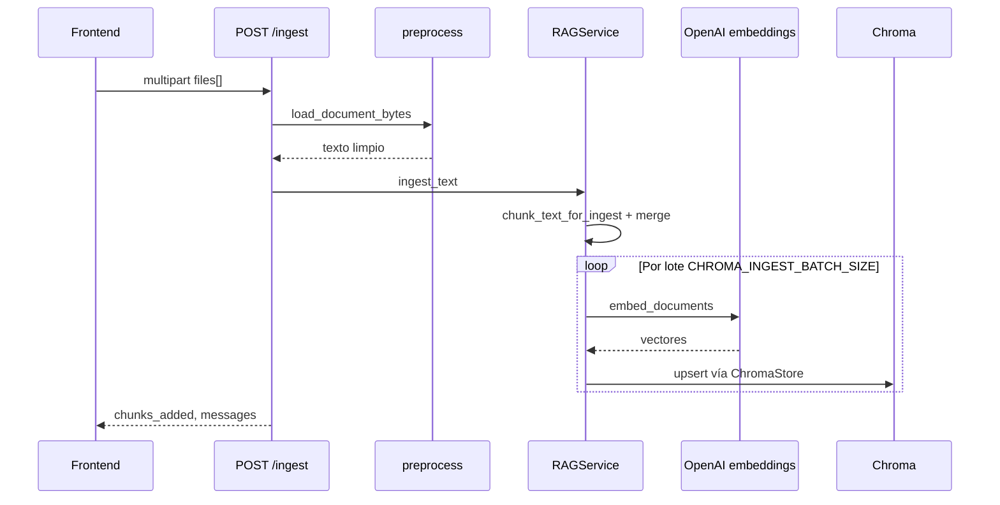
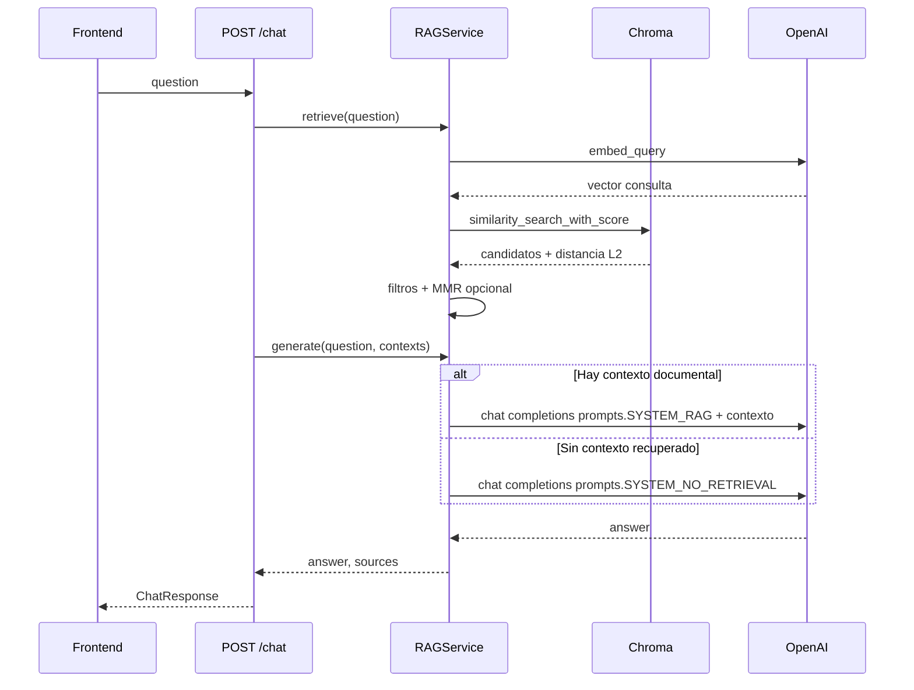
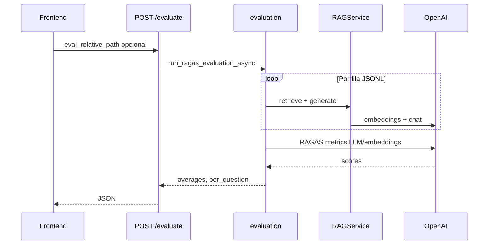
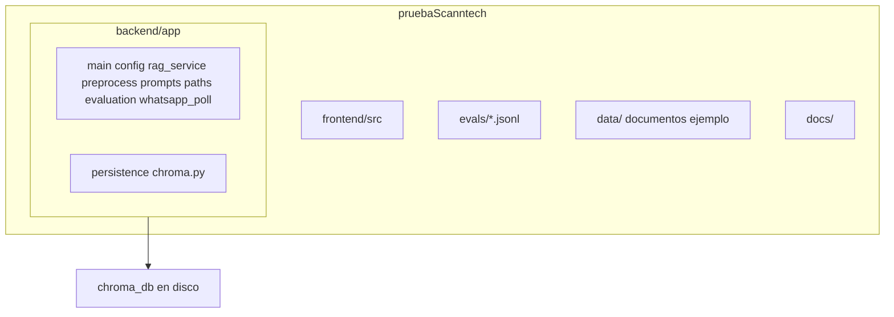
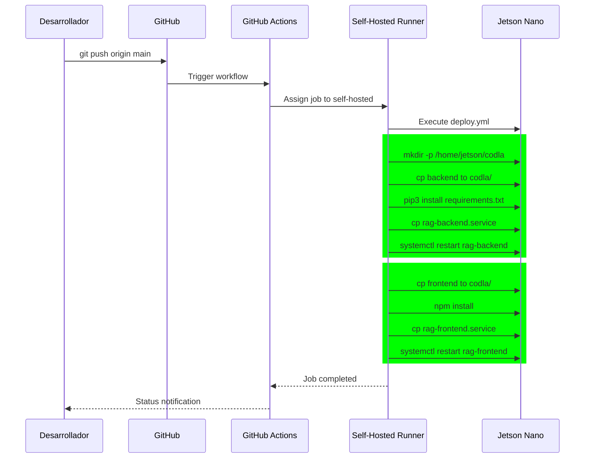

# Arquitectura del sistema RAG

Documento de referencia para la prueba técnica: componentes, flujos, persistencia, **prompts del LLM** y **variables de entorno** alineadas con `backend/app/config.py` y los `.env.example`.

---

## 1. Objetivo

Sistema **RAG** (Retrieval-Augmented Generation) para **control de calidad del conocimiento interno**: los usuarios indexan documentos (PDF, Markdown, texto), el backend recupera contenido relevante con embeddings y un LLM genera respuestas ancladas a la documentación, con **lenguaje claro** hacia el usuario final (sin jerga interna tipo “fragmentos” en las respuestas). La evaluación **RAGAS** mide fidelidad, relevancia, precisión y recuperación del contexto. Opcionalmente, el mismo flujo alimenta **respuestas por WhatsApp** vía una API HTTP en red (p. ej. Jetson + GOWA).

---

## 2. Vista de contexto

Actores externos, aplicación y almacenes lógicos.



- **Frontend**: no contiene secretos; solo llama al backend.
- **Backend**: único componente con `OPENAI_API_KEY` y acceso a Chroma; opcionalmente consulta la **API WhatsApp** en otro host (p. ej. Jetson) y expone `POST /webhooks/whatsapp`.
- **Chroma**: SQLite + archivos de persistencia bajo `CHROMA_PERSIST_DIRECTORY`.
- **Jetson (opcional)**: GOWA en **:3000** y servicio Flask en **:8090**; el RAG solo usa HTTP al **:8090**. Endpoints de lectura relevantes: **`GET /messages/recent`** (últimos mensajes globales; cada ítem incluye **`is_from_me: true|false`**) y **`GET /messages?chat_jid=…`** (historial de un chat; mismo campo). Envío: **`POST /send/text`**. Lista de chats: **`GET /chats`**.

---

## 3. Contenedores y módulos del backend



| Módulo | Rol |
|--------|-----|
| `main.py` | Rutas HTTP, modelos Pydantic, CORS, ciclo de vida (`lifespan`). |
| `config.py` | `Settings`: lectura de `.env` y validación (p. ej. ruta absoluta de Chroma). |
| `rag_service.py` | Orquesta embeddings, chunking, recuperación (L2, margen, codo, MMR) y llamadas al LLM; usa `ChromaStore` y `prompts`. |
| `persistence/chroma.py` | `ChromaStore`: cliente LangChain Chroma, permisos y prueba de escritura en disco, ingesta por lotes con reintento ante sqlite readonly, conteo y borrado de la carpeta de persistencia. |
| `prompts.py` | Instrucciones de sistema (`SYSTEM_RAG`, `SYSTEM_NO_RETRIEVAL`) y plantillas de mensaje de usuario (`build_rag_user_message`, etc.). |
| `preprocess.py` | Carga de documentos, limpieza PDF, segmentación por fences Markdown, fusión de trozos cortos. |
| `prompt_store.py` (y rutas de prompts en `main.py`) | Lectura/escritura de system prompts editables; no reinicia el backend. |
| `evaluation.py` | Pipeline RAGAS asíncrono sobre el mismo `RAGService`. |
| `paths.py` | Resolución segura de rutas bajo `evals/`. |
| `whatsapp_poll.py` | Integración WhatsApp: polling a la API remota, webhook entrante, deduplicación, eco de respuestas del bot, envío `POST /send/text`. |

---

## 3B. Secuencia: WhatsApp (polling o webhook)

Mismo núcleo RAG que `POST /chat`; la salida se envía al número vía API Jetson.



---

## 4. Secuencia: ingesta de documentos



Tras cambiar `CHUNK_SIZE` / `CHUNK_OVERLAP` conviene `POST /ingest/reset` y volver a subir archivos.

---

## 5. Secuencia: chat (pregunta → respuesta)



---

## 6. Secuencia: evaluación RAGAS

RAGAS y dependencias (`datasets`, etc.) van en el mismo `requirements.txt` del backend.



---

## 7. Estructura de carpetas (alto nivel)



- **`backend/app/persistence/`**: capa de infraestructura para Chroma (`ChromaStore` en `chroma.py`); separa I/O y permisos de la lógica RAG en `rag_service.py`.
- **`backend/app/prompts.py`**: único lugar habitual para editar textos de sistema y plantillas de usuario del chat; incluye reglas de **tono** hacia el usuario final (evitar jerga tipo “fragmentos” o “RAG” en respuestas).

---

## 8. Variables de entorno — backend

Definidas en `backend/app/config.py` (Pydantic Settings). Los nombres en **MAYÚSCULAS** son los de entorno; el código usa `snake_case`. La **justificación** de cada valor por defecto y cuándo cambiarlo está en [VARIABLES_ENTORNO.md](./VARIABLES_ENTORNO.md).

| Variable (env) | Campo en código | Tipo / default | Descripción |
|----------------|-----------------|----------------|-------------|
| `OPENAI_API_KEY` | `openai_api_key` | `str`, `""` | Obligatoria para RAG: embeddings y chat. Si falta, `_rag` queda en `None`. |
| `OPENAI_CHAT_MODEL` | `openai_chat_model` | `gpt-4o-mini` | Modelo de chat para respuestas y ramas sin contexto. |
| `OPENAI_CHAT_TEMPERATURE` | `openai_chat_temperature` | `0.1` | Temperatura del chat RAG (`/chat`); validado entre 0 y 2. |
| `OPENAI_EMBEDDING_MODEL` | `openai_embedding_model` | `text-embedding-3-small` | Modelo de embeddings para índice y consultas. |
| `OPENAI_EMBEDDING_DIMENSIONS` | `openai_embedding_dimensions` | *vacío* | Dimensiones MRL (p. ej. 1024) con `text-embedding-3-large`; vacío = nativas. Cambiar implica reindexar. |
| `OPENAI_API_BASE` | `openai_api_base` | `None` | Base URL opcional (Azure OpenAI u otro compatible). |
| `CHROMA_PERSIST_DIRECTORY` | `chroma_persist_directory` | `./chroma_db` | Carpeta de persistencia Chroma. Las rutas **relativas** se resuelven respecto a **`backend/`**, no al CWD de uvicorn. |
| `CHROMA_COLLECTION_NAME` | `chroma_collection_name` | `internal_knowledge` | Nombre de la colección vectorial. |
| `CHROMA_INGEST_BATCH_SIZE` | `chroma_ingest_batch_size` | `128` | Tamaño de lote al hacer `add_documents` (PDFs grandes). |
| `CHUNK_SIZE` | `chunk_size` | `1280` | Tamaño máximo aproximado del fragmento (caracteres). |
| `CHUNK_OVERLAP` | `chunk_overlap` | `256` | Solapamiento entre fragmentos del splitter recursivo. |
| `CHUNK_MIN_CHARS` | `chunk_min_chars` | `400` | Mínimo objetivo por trozo tras fusionar títulos sueltos con el vecino. |
| `CHUNK_MERGE_HARD_MAX` | `chunk_merge_hard_max` | `0` | Tope al fusionar trozos; **`0` = 2 × CHUNK_SIZE**. |
| `TOP_K` | `top_k` | `6` | Máximo de fragmentos pasados al LLM tras recuperación/MMR. |
| `USE_MMR` | `use_mmr` | `true` | Activa Maximum Marginal Relevance para diversidad. |
| `MMR_FETCH_K` | `mmr_fetch_k` | `80` | Candidatos a considerar antes de MMR. |
| `MMR_LAMBDA` | `mmr_lambda` | `0.91` | Balance relevancia vs diversidad en MMR (más alto = más relevancia). |
| `RETRIEVE_MAX_L2_DISTANCE` | `retrieve_max_l2_distance` | `1.3` | Umbral L2 de Chroma: por encima se descarta el candidato. |
| `RETRIEVE_RELEVANCE_MARGIN` | `retrieve_relevance_margin` | `0.10` | Solo se mantienen fragmentos con distancia ≤ mejor + margen (con ajuste si `best_d ≥ 0.75`). |
| `RETRIEVE_ELBOW_L2_GAP` | `retrieve_elbow_l2_gap` | `0.0` | Si > 0, corta la lista cuando el salto L2 entre vecinos ordenados supera este valor. |
| `CORS_ORIGINS` | `cors_origins` | `http://localhost:4444,...` | Orígenes permitidos, separados por coma. |
| `MAX_UPLOAD_BYTES` | `max_upload_bytes` | `209715200` (~200 MiB) | Tamaño máximo por archivo en `POST /ingest`. |
| `LLM_RETRIEVAL_PROFILE` | `llm_retrieval_profile` | `true` | Mini-llamada LLM para decidir recuperación amplia vs normal. |

**WhatsApp** (`WHATSAPP_*`): ver [VARIABLES_ENTORNO — WhatsApp](./VARIABLES_ENTORNO.md#whatsapp-jetson) y `backend/.env.example`.

---

## 9. Variables de entorno — frontend

| Variable | Descripción |
|----------|-------------|
| `VITE_API_BASE_URL` | URL base del API FastAPI (sin barra final). En código, si se define la variable **vacía** (`VITE_API_BASE_URL=`), el frontend usa el **mismo origen** que la página (útil con Nginx: sitio en `https://…` y API en `https://…/api/…`). Valor no definido: por defecto `http://127.0.0.1:3333` en el bundle. |

Vite solo expone al bundle variables que empiezan por `VITE_`.

---

## 10. API REST (resumen)

| Método | Ruta | Uso |
|--------|------|-----|
| `GET` | `/health` | Estado del servicio y si el RAG está inicializado. |
| `GET` | `/stats` | `chunk_count`, `collection`, `ready`. Puede leerse justo **después** de `POST /ingest` con un valor aún bajo o 0 (proxy, varios workers, timing SQLite); el cliente y la respuesta de ingesta alivian esto. |
| `GET` | `/stats/sources` | Lista de nombres de fuente distintas en metadatos Chroma. |
| `GET` | `/config` | Parámetros públicos de chunking y recuperación (sin secretos). |
| `GET` / `PUT` / `DELETE` | `/config/prompts` | System prompts por canal (web, WhatsApp, evaluación); persisten en un JSON en el backend. |
| `POST` | `/ingest` | Multipart, campo `files`: indexa PDF/MD/TXT. Carga y chunking pesados se ejecutan en **hilo** para no bloquear el *event loop*. Respuesta JSON: `files_processed`, `chunks_added`, `messages[]`, además **`chunk_count`** (total de vectores en Chroma *tras* la operación, mismo proceso que escribió) y `ready`. |
| `POST` | `/ingest/delete-source` | Body JSON con `source`: borra vectores cuyo metadato `source` coincide. |
| `POST` | `/ingest/reset` | Borra persistencia Chroma en disco y recrea índice vacío. |
| `POST` | `/chat` | Body JSON `{"question": "..."}` → `answer` + `sources`. |
| `GET` | `/retrieve` | Depuración: contextos recuperados para `q`. |
| `POST` | `/evaluate` | RAGAS; query opcional `eval_relative_path`. |
| `GET` | `/webhooks/whatsapp` | Comprobación e indicaciones de integración (WhatsApp). |
| `POST` | `/webhooks/whatsapp` | Cuerpo JSON con mensaje(s) entrante(s); opcional secreto vía cabecera (ver `WHATSAPP_WEBHOOK_SECRET`). |

`GET /config` expone, entre otros, `whatsapp_polling_active`, `whatsapp_webhook_active`, `whatsapp_poll_mode`, `whatsapp_api_base_url`, `whatsapp_poll_interval_sec` (sin secretos).

---

## 10B. Ingesta, UI y contador de fragmentos

- Tras un `POST /ingest` correcto, el JSON incluye **`chunk_count`** = `collection_count()` de Chroma en el **mismo proceso** que acaba de escribir; es el valor que debe priorizar el frontend si `GET /stats` momentáneamente devuelve 0 o menos.
- En el **frontend**, `fetchStats` usa `cache: 'no-store'`; el encabezado no muestra “0 fragmentos” como total definitivo **hasta** el primer `GET /stats` resuelto; la ingesta aplica *patch* y reconciliación con el total de la respuesta de `POST /ingest` y con `chunks_added` para no regresar el contador.

---

## 11. Decisiones de diseño breves

- **Precisión documental**: con contexto recuperado del índice, el system prompt en `app.prompts` (`SYSTEM_RAG`) exige ceñirse al material documental; sin coincidencias útiles se usa `SYSTEM_NO_RETRIEVAL` para distinguir preguntas meta de falta de cobertura.
- **Lenguaje al usuario**: las instrucciones del LLM piden tono profesional y evitan términos técnicos internos (“fragmentos”, “embeddings”) en las respuestas finales, salvo que el usuario pregunte cómo funciona la herramienta.
- **PDF**: PyMuPDF primero; limpieza de artefactos (`|`, glifos, ejes) en `preprocess.py`.
- **Código en Markdown**: separadores y segmentación por bloques `` ``` `` para no partir fences completos cuando caben en el tope de fusión.
- **Chroma**: persistencia local gestionada por `ChromaStore`; el reset elimina la carpeta configurada (con salvaguardas de ruta en `RAGService`) para evitar índices huérfanos.

---

---

## 12. Arquitectura de Despliegue con GitHub Actions (Self-Hosted Runner)

### 12.1 Vista General del Sistema

```
┌─────────────────────────────────────────────────────────────────────────────┐
│                        NVIDIA JETSON NANO                              │
│                    (192.168.1.254 - ARM64)                            │
│  ┌─────────────────────────────────────────────────────────────────┐            │
│  │              Self-Hosted Runner (GitHub Actions)              │            │
│  │         ~/actions-runner ( jetson-runner-2 )              │            │
│  └─────────────────────────────────────────────────────────────────┘            │
│                              │                                         │
│         ┌────────────────────┼────────────────────┐                       │
│         │                    │                    │                       │
│         ▼                    ▼                    ▼                       │
│  ┌─────────────┐    ┌─────────────┐    ┌─────────────┐                │
│  │   Backend  │    │  Frontend  │    │  WhatsApp   │                │
│  │FastAPI    │    │  React    │    │  Bridge    │                │
│  │:3333      │    │  :4444    │    │  :8090     │                │
│  └─────────────┘    └─────────────┘    └─────────────┘                │
│         │                    │                    │                       │
│         └────────────────────┼────────────────────┘                       │
│                            │                                         │
│                            ▼                                         │
│                   ┌─────────────────┐                               │
│                   │  Chroma Vector  │                               │
│                   │     Store       │                               │
│                   └─────────────────┘                               │
└─────────────────────────────────────────────────────────────────────────────┘
         ▲
         │
         │ Internet
         │
┌────────┴────────┐
│   GitHub Repo    │
│  codla.git    │
│  main branch  │
└────────┬────────┘
         │
         │ push
         ▼
┌─────────────────────┐
│ GitHub Actions      │
│ deploy.yml        │
│ (self-hosted)    │
└─────────────────────┘
```

### 12.2 Componentes del Deployment

| Componente | Ubicación | Puerto | Descripción |
|------------|-----------|--------|------------|
| **GitHub Actions** | cloud.github.com | - | Orchestrates deployment on push to `main` |
| **Self-Hosted Runner** | Jetson Nano | - | Executes jobs locally (ARM64) |
| **Backend FastAPI** | `/home/jetson/codla/backend` | 3333 | RAG API with Chroma |
| **Frontend React** | `/home/jetson/codla/frontend` | 4444 | Web UI |
| **WhatsApp Bridge** | Jetson :8090 | 8090 | Flask API for GOWA |
| **Chroma DB** | `/home/jetson/codla/backend/chroma_db` | - | Vector embeddings storage |

### 12.3 Flujo de Deployment



### 12.4 Configuración del Runner

**Una sola vez (en Jetson):**

```bash
# 1. Crear directorio
mkdir -p ~/actions-runner && cd ~/actions-runner

# 2. Descargar runner ARM64
curl -o actions-runner-linux-arm64.tar.gz -L \
  https://github.com/actions/runner/releases/download/v2.333.1/actions-runner-linux-arm64-2.333.1.tar.gz
tar xzf actions-runner-linux-arm64.tar.gz

# 3. Configurar con token
./config.sh --url https://github.com/godie007/codla --token <TOKEN> --name jetson-runner-2 --unattended

# 4. Ejecutar
./run.sh
```

**Como servicio systemd:**

```bash
sudo ./svc.sh install
sudo ./svc.sh start
```

### 12.5 Workflow de Deployment

```yaml
# .github/workflows/deploy.yml
name: Deploy to Jetson

on:
  push:
    branches: [main]

jobs:
  deploy:
    runs-on: self-hosted  # → Jetson Nano

    steps:
      - name: Checkout code
        uses: actions/checkout@v4

      - name: Deploy Backend
        run: |
          mkdir -p /home/jetson/codla
          rm -rf /home/jetson/codla/backend
          cp -r $GITHUB_WORKSPACE/backend /home/jetson/codla/
          cd /home/jetson/codla/backend
          pip3 install -r requirements.txt || pip3 install uvicorn fastapi langchain chromadb openai

      - name: Deploy Frontend
        run: |
          mkdir -p /home/jetson/codla
          rm -rf /home/jetson/codla/frontend
          cp -r $GITHUB_WORKSPACE/frontend /home/jetson/codla/
          cd /home/jetson/codla/frontend
          npm install
```

### 12.6 Servicios Systemd

**Backend service** (`/etc/systemd/system/rag-backend.service`):

```ini
[Unit]
Description=RAG Backend Service
After=network.target

[Service]
User=jetson
WorkingDirectory=/home/jetson/codla/backend
Environment="PATH=/usr/local/bin:/usr/bin:/bin"
ExecStart=/usr/bin/python3 -m uvicorn app.main:app --host 0.0.0.0 --port 3333
Restart=always
RestartSec=10

[Install]
WantedBy=multi-user.target
```

**Frontend service** (`/etc/systemd/system/rag-frontend.service`):

```ini
[Unit]
Description=RAG Frontend Service
After=network.target

[Service]
User=jetson
WorkingDirectory=/home/jetson/codla/frontend
Environment="PATH=/usr/local/bin:/usr/bin:/bin"
Environment="NODE_ENV=production"
ExecStart=/usr/bin/npm run dev -- --host 0.0.0.0 --port 4444
Restart=always
RestartSec=10

[Install]
WantedBy=multi-user.target
```

### 12.7 Gestión del Runner

```bash
# Ver estado
systemctl status actions.runner.godie007-codla.jetson-runner

# Reiniciar
sudo systemctl restart actions.runner.godie007-codla.jetson-runner

# Ver logs
tail -f ~/runner.log

# Detener
sudo systemctl stop actions.runner.godie007-codla.jetson-runner
```

### 12.8 Notas de Producción

1. **Espacio en disco**: La Jetson Nano tiene ~29GB (SD). Mantener al menos 1GB libre para logs y operaciones.
2. **Token**: Generar nuevo token en Repo > Settings > Actions > Runners > New self-hosted runner.
3. **Actualizaciones**: Si el runner no recibe jobs, verificar que esté corriendo y conectado.
4. **Errores comunes**:
   - `No space left on device`: Limpiar `/tmp`, `_work`, `_diag`
   - `pip3: No module named uvicorn`: Instalar dependencias explícitamente

---

*Última revisión: integración WhatsApp, deployment con GitHub Actions en Jetson Nano, workflow actualizado con manejo de errores y servicios systemd.*
