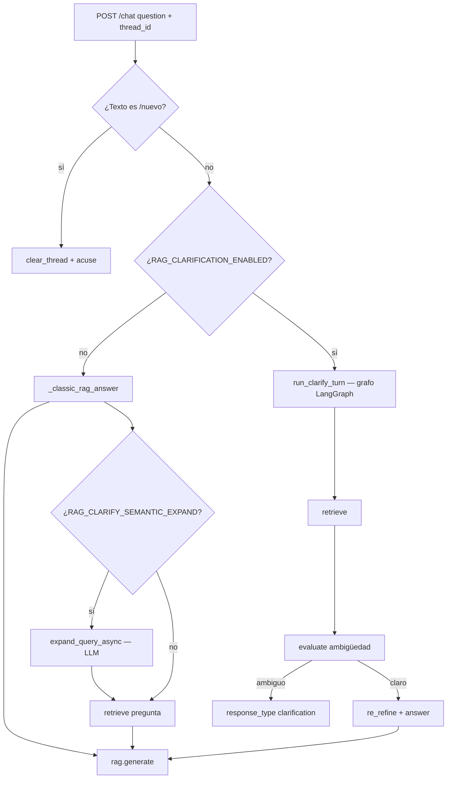

# Arquitectura del chatbot (preguntas, prompts y flujo RAG)

Este documento describe cómo el backend transforma una **pregunta del usuario** en una **respuesta**, qué **system prompts** intervienen, el **bucle de clarificación** opcional y la **persistencia** de instrucciones personalizadas. Está alineado con `backend/app/main.py`, `rag_service.py`, `prompts.py`, `prompt_store.py`, `clarify_bridge.py` y `clarification_flow.py`.

---

## 1. Punto de entrada: `POST /chat`

| Campo | Rol |
|--------|-----|
| `question` | Texto de la pregunta (1–8000 caracteres). |
| `thread_id` | Identificador de hilo (opcional). Si no se envía, el servidor genera un UUID y lo devuelve; el cliente debe **reutilizarlo** en turnos siguientes para mantener el estado del bucle de clarificación. |

**Respuesta** (`ChatResponse`):

| Campo | Rol |
|--------|-----|
| `answer` | Texto mostrado al usuario (tras limpieza ligera de glifos residuales de PDF). |
| `sources` | Extractos recuperados que alimentaron al LLM en la última generación (metadatos `source`, `chunk_id`, etc.). Vacío si no hubo contexto útil o si la salida fue solo una **pregunta de clarificación**. |
| `thread_id` | Mismo hilo que debes reenviar en la siguiente petición. |
| `response_type` | `"answer"` — respuesta final del asistente; `"clarification"` — el backend pide un matiz antes de responder con RAG completo. |

**Comando de conversación nueva:** si el usuario envía exactamente `/nuevo` (tras `strip`, comparación case-insensitive en `conversation_commands.py`), se **borra el estado del hilo** en memoria y se responde con un acuse; no pasa por el RAG.

---

## 2. Vista general del flujo

- **RAG clásico** (`RAG_CLARIFICATION_ENABLED=false`): expansión semántica opcional → `retrieve` → `generate`.
- **Bucle de clarificación** (`true`): un grafo **retrieve → evaluación estructurada de ambigüedad →** o bien **pregunta al usuario** (`clarification`) o **re-refinar consulta y responder** (`answer`).

---

## 3. System prompts: qué existe y dónde se configura

### 3.1 Cuatro textos editables en runtime (web / WhatsApp)

El módulo `prompt_store.py` mantiene **cuatro** system prompts efectivos, mezclando **valores por defecto del código** (`app/prompts.py`) con un archivo opcional **`backend/system_prompts.json`**.

| Clave en API / JSON | Uso en generación |
|---------------------|-------------------|
| `system_rag_web` | Con fragmentos recuperados, canal **web** (y chat por defecto en la API). |
| `system_rag_whatsapp` | Con fragmentos recuperados, canal **WhatsApp**. |
| `system_no_retrieval_web` | **Sin** contexto indexado (retriever devolvió lista vacía), canal web. |
| `system_no_retrieval_whatsapp` | Sin contexto, canal WhatsApp. |

- **API REST:** `GET` / `PUT` / `DELETE` **`/config/prompts`**. `PUT` fusiona; **cadena vacía** o borrar clave = volver al default del código. **No requiere reiniciar** uvicorn.
- **UI:** pestaña **Configuraciones** en el frontend.

En `RAGService.generate` (`rag_service.py`), la elección es:

- Si `contexts` está vacío → `get_system_no_retrieval_for_channel(channel)` + `build_no_retrieval_user_message(question)`.
- Si hay contexto → `get_system_rag_for_channel(channel)` + mensaje de usuario con bloques citados (`build_rag_user_message` / formato `[Source: …]`).

El canal en `/chat` es fijo **`web`**. En WhatsApp (polling o webhook) se usa **`whatsapp`**, de modo que puedes afinar tono o brevedad distinta para móvil.

### 3.2 Prompts solo en código (no expuestos en `/config/prompts`)

| Constante / uso | Fichero | Función |
|-----------------|---------|---------|
| `SYSTEM_CLARIFICATION_AMBIGUITY_EVAL` | `prompts.py` | Instrucciones del **evaluador** del bucle de clarificación: decide si la consulta es ambigua respecto a los extractos, propone `clarification_question` o `refined_query`. **No** es el tono de la respuesta final al usuario salvo en el caso `clarification` (el texto devuelto es la pregunta de aclaración). |
| `SYSTEM_RAG` / `SYSTEM_NO_RETRIEVAL` | `prompts.py` | Origen de los defaults de los cuatro prompts configurables. |
| `RETRIEVAL_PROFILE_CLASSIFY_SYSTEM` | `prompts.py` | Clasificador "broad" vs "normal" para **ampliar** criterios de recuperación en preguntas de cobertura ("¿qué cubre el índice?"). Afecta a **`retrieve`**, no al mensaje `system` del chat final. |
| Plantilla de expansión semántica | `expand_query.py` | `ChatPromptTemplate` con instrucciones de dominio (sinónimos, normativa, etc.); alimenta la **query** al embedding, no el system del chat. |

---

## 4. Sistema de preguntas: RAG clásico

1. **Pregunta** del usuario (y opcionalmente **expansión**): si `RAG_CLARIFY_SEMANTIC_EXPAND=true`, se llama a `expand_query_async` (LLM estructurado) y el texto resultante se usa en **`rag.retrieve`**. La **generación** sigue usando la **pregunta original** del usuario.
2. **Recuperación** (`rag.retrieve`): embedding de la consulta, búsqueda en Chroma, filtros L2, MMR, etc. (según `config.py`). Opcionalmente, si `LLM_RETRIEVAL_PROFILE=true`, una micro-llamada clasifica la intención para ajustar el modo *broad* vs *normal*.
3. **Generación** (`rag.generate`): si no hay trozos, system **sin recuperación**; si hay trozos, system **RAG** + user con contexto formateado.

Así, el "sistema de preguntas" no es un motor aparte: es **la misma pregunta** (y a veces una **versión expandida solo para búsqueda**) más el **estado de hilo** si el modo clarificación está activo.

---

## 5. Bucle de clarificación (opcional)

Activado con `RAG_CLARIFICATION_ENABLED=true` en el entorno. Parámetros relacionados en `GET /config`:

- `rag_clarification_max_rounds` — máximo de **preguntas de clarificación** consecutivas por hilo (0 desactiva en la práctica el ramal útil de clarificar).
- `rag_clarify_semantic_expand` — expansión semántica **también** en este modo (nodo `retrieve` del grafo).

**Grafo** (`clarification_flow.py`): `retrieve` → `evaluate` (LLM con salida estructurada `AmbiguityEvaluation`) → si procede, `clarify` (respuesta con `response_type: clarification`) **o** `re_refine` (segundo retrieve con `refined_query` si el evaluador la proveyó) → `answer` (`rag.generate`).

**Estado de hilo** (`clarify_store.py`, en memoria, TTL ~2 h):

- Tras enviar una **clarification**, se guarda la consulta efectiva y el contador de rondas (`set_after_clarification`); se **preserva** el `turn_history` de turnos ya cerrados.
- Tras un **`response_type: answer`**, ya no se borra el hilo: se llama a **`mark_answered`**, que añade un par (pregunta del usuario + resumen de la respuesta, truncado) a `turn_history` y reinicia la ronda de clarificación. Así el nodo **`evaluate`** recibe, vía `thread_history_for_evaluator`, un bloque de historial en el mensaje al evaluador (no confundir con la respuesta final al usuario).
- Mientras el hilo **espera matiz** (`awaiting_clarification`), `build_effective_query` **concatena** la consulta acumulada con el nuevo texto.
- Tras una respuesta final, si el usuario envía un **seguimiento**, `build_effective_query` antepone un prefijo de contexto (última pregunta + resumen) para el **retrieve** del turno siguiente.

Si el grafo falla por excepción, se hace **fallback** a RAG clásico para no dejar al usuario sin respuesta.

---

## 6. Modelo de chat y parámetros de generación

Configuración vía `OPENAI_CHAT_MODEL`, `OPENAI_CHAT_TEMPERATURE`, `OPENAI_CHAT_MAX_OUTPUT_TOKENS` (`.env`). Afecta a **todas** las invocaciones del `ChatOpenAI` principal en `RAGService` (incluida la respuesta mostrada al usuario). El nodo de **evaluación de ambigüedad** usa el mismo modelo con `temperature=0` y límite de tokens acotado.

---

## 7. Evaluación RAGAS vs chat interactivo

`POST /evaluate` usa `rag.retrieve` con `infer_broad_retrieval=false` y `rag.generate(q, chunks)` **sin** pasar `channel` explícito, por lo que se usa el valor por defecto del método: **`web`**. **No** ejecuta el grafo de clarificación: mide el pipeline "directo" de recuperación + generación. Los system prompts RAG se siguen tomando de `prompt_store` (canal web).

---

## 8. Referencias cruzadas

- Variables de entorno: [VARIABLES_ENTORNO.md](./VARIABLES_ENTORNO.md) (`RAG_CLARIFICATION_*`, `LLM_RETRIEVAL_PROFILE`, etc.).
- Visión de componentes y API: [ARQUITECTURA.md](./ARQUITECTURA.md).
- Definición de constantes y plantillas: `backend/app/prompts.py`, `backend/app/prompt_store.py`.
